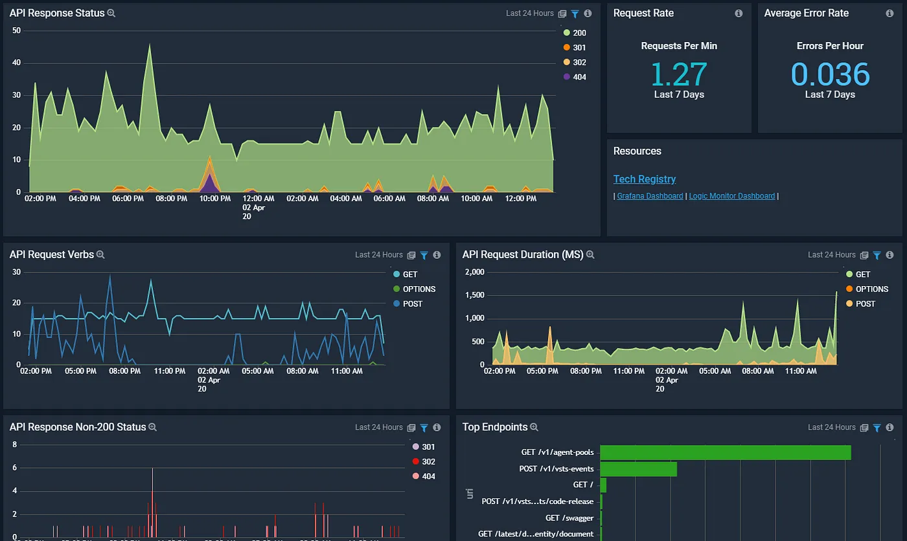

# Creating Request Logging Middleware in ASP.NET Core

Middleware in ASP.NET Core allows you to handle HTTP requests and responses at various stages of their lifecycle. Logging incoming requests can be incredibly useful for debugging, auditing, or monitoring your application’s performance. In this post, we’ll walk through creating custom request logging middleware for an ASP.NET Core application.

### What is Middleware?

Middleware in ASP.NET Core is software that’s assembled into an application pipeline to handle requests and responses. Each middleware component chooses whether to pass the request to the next component in the pipeline and can perform actions before or after the next component processes the request.

### Setting Up Your Project

To get started, make sure you have the .NET SDK installed. You can create a new ASP.NET Core project with the following command:

```shell
dotnet new webapi -n RequestLoggingDemo
```

# Navigate to the project directory:

```shell
cd RequestLoggingDemo
```

# Step 1: Create the Middleware

First, create a new file called `RequestLoggingMiddleware.cs` in the root of your project (or in a Middleware folder if you prefer to organize your code).

Here’s the code for the middleware:

```csharp
using Microsoft.AspNetCore.Http;
using System.Threading.Tasks;
using System.IO;
using Microsoft.Extensions.Logging;

public class RequestLoggingMiddleware(RequestDelegate next, ILogger<RequestLoggingMiddleware> logger)
{
    public async Task InvokeAsync(HttpContext context)
    {
        context.Request.EnableBuffering();
        // Read the request body (if present)
        string requestBody;
        using (var reader = new StreamReader(
            context.Request.Body,
            encoding: System.Text.Encoding.UTF8,
            detectEncodingFromByteOrderMarks: false,
            bufferSize: 1024,
            leaveOpen: true))
        {
            requestBody = await reader.ReadToEndAsync();
            context.Request.Body.Position = 0; // Reset stream position
        }
        // Log the request details
        _logger.LogInformation($"HTTP {context.Request.Method} {context.Request.Path} {context.Request.QueryString}\nBody: {requestBody}");
        // Call the next middleware in the pipeline
        await _next(context);
    }
}

```

### Step 2: Add the Middleware to the Pipeline

In ASP.NET Core, middleware is added to the pipeline in the Program.cs file. Update your Program.cs to include the middleware:

```csharp
var builder = WebApplication.CreateBuilder(args);

// Add services to the container.
builder.Services.AddControllers();

// Add logging
builder.Logging.AddConsole();

var app = builder.Build();

// Add custom middleware
app.UseMiddleware<RequestLoggingMiddleware>();

// Configure the HTTP request pipeline
if (app.Environment.IsDevelopment())
{
    app.UseDeveloperExceptionPage();
}
app.UseHttpsRedirection();
app.UseAuthorization();
app.MapControllers();
app.Run();
```

### Step 3: Run and Test

Run your application using the following command:

```shell
dotnet run
```

Send a request to your API using a tool like Postman or curl. For example:

```shell
curl -X POST https://localhost:5001/api/values -d '{"key": "value"}' -H "Content-Type: application/json"
```

Check your console logs to see the logged request details:

```
info: RequestLoggingMiddleware[0]
HTTP POST /api/values
Body: {"key": "value"}
```

### Customizing the Middleware

You can enhance the middleware to log additional information, such as headers or response details. For example, you could log the status code and response body by wrapping \_next(context) in a try-finally block and capturing the response stream.

### Conclusion

Creating custom middleware in ASP.NET Core is a straightforward way to extend the functionality of your application. With request logging middleware, you can gain better insights into the requests your application handles, making debugging and monitoring easier. Try experimenting with this middleware and customize it to suit your specific needs!
