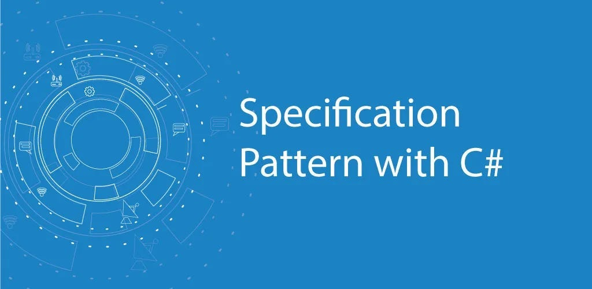

## Mastering the Specification Pattern

Software development often requires crafting solutions that are both robust and maintainable. One way to achieve this is by adhering to established design patterns. The Specification Pattern is a lesser-known but powerful tool for encapsulating business logic and ensuring cleaner code. In this article, we’ll explore how to implement the Specification Pattern using the Ardalis.Specification package in a .NET project.

## What is the Specification Pattern?

The Specification Pattern is a design pattern used to encapsulate business rules. It allows you to combine and reuse rules without tightly coupling them to your entities or services. Instead of scattering query logic throughout your codebase, specifications centralize this logic into reusable and composable classes.

## Why Use Ardalis.Specification?

The `Ardalis.Specification` library provides a robust implementation of the Specification Pattern in .NET. It simplifies querying and filtering, especially in conjunction with repositories. By using this package, you can:

- Centralize business logic: Keep query specifications in a single place.
- Promote reusability: Reuse specifications across multiple services or repositories.
- Enhance testability: Specifications are easier to test than inline LINQ queries.

# Getting Started

To follow along, ensure you have:

- A .NET 6+ project.
- A basic understanding of Entity Framework Core (EF Core).
- The Ardalis.Specification package installed.

# Install Ardalis.Specification

```shell
dotnet add package Ardalis.Specification
```

## Setting Up the Project

Assume you have an e-commerce application with an Order entity:

```csharp
public class Order
{
  public int Id { get; set; }
  public DateTime OrderDate { get; set; }
  public string CustomerName { get; set; }
  public decimal TotalAmount { get; set; }
  public bool IsShipped { get; set; }
}
```

Now, let’s implement the Specification Pattern.

## Defining Specifications

A specification encapsulates the filtering logic. For example, suppose you need to fetch all unshipped orders for a specific customer:

```csharp
using Ardalis.Specification;

public class UnshippedOrdersSpecification : Specification<Order>
{
  public UnshippedOrdersSpecification(string customerName)
  {
  Query.Where(o => !o.IsShipped && o.CustomerName == customerName);
  }
}
```

Here, we define a class inheriting from Specification<T> and use the Query property to specify filtering logic.

## Integrating with Repositories

Repositories provide an abstraction over data access. Here’s how you can integrate specifications:

```csharp
using Ardalis.Specification.EntityFrameworkCore;

public interface IRepository<T> : IRepositoryBase<T> where T : class
{
}

public class Repository<T> : RepositoryBase<T>, IRepository<T> where T : class
{
  public Repository(AppDbContext dbContext) : base(dbContext)
  {
  }
}
```

The `RepositoryBase<T> from Ardalis.Specification.EntityFrameworkCore provides built-in support for specifications.

Using Specifications

With the repository and specifications in place, you can query data:

```csharp
public class OrderService
{
  private readonly IRepository<Order> _orderRepository;

    public OrderService(IRepository<Order> orderRepository)
    {
        _orderRepository = orderRepository;
    }

    public async Task<List<Order>> GetUnshippedOrdersForCustomerAsync(string customerName)
    {
        var spec = new UnshippedOrdersSpecification(customerName);
        return await _orderRepository.ListAsync(spec);
    }
}
```

Here, we use the `ListAsync` method to fetch data based on the specification.

## Testing Specifications

Specifications are simple to test because they are isolated. Use an in-memory database or mock repository:

```csharp
[Fact]
public void UnshippedOrdersSpecification_ReturnsCorrectResults()
{
  // Arrange
  var orders = new List<Order>
  {
    new Order { Id = 1, CustomerName = "Alice", IsShipped = false },
    new Order { Id = 2, CustomerName = "Alice", IsShipped = true },
    new Order { Id = 3, CustomerName = "Bob", IsShipped = false }
  }.AsQueryable();

  var spec = new UnshippedOrdersSpecification("Alice");

  // Act
  var result = orders.Where(spec.WhereExpressions.First().Compile()).ToList();

    // Assert
  Assert.Single(result);
  Assert.Equal(1, result.First().Id);
}
```

## Conclusion

The Specification Pattern, when implemented using Ardalis.Specification, promotes clean architecture and reusable query logic. By encapsulating business rules in specifications, your application becomes more maintainable, testable, and robust. Whether you’re building a small project or a complex enterprise solution, this pattern is a valuable addition to your toolkit.
